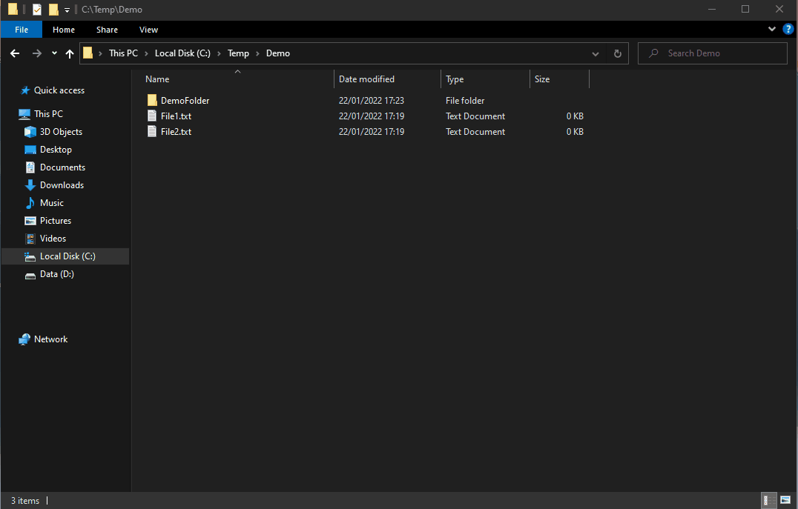

  

<h1 align="center">
  BasicSearch
</h1>

 Search. The Right Way.

  

## Introduction

BasicSearch is like an addon to Windows default File Explorer program. It enables you to search in a much simpler way. Just press <kbd>ctrl + shift + f</kbd> and search for the folder/file you want.
I took the inspiration from Gnome file explorer search in Linux, so for those of you who ever worked with that, it may look similar

## Installation

- Download and extract the latest [release](https://github.com/Gil-Tayar/BasicSearch/releases).
- Install using setup.exe
- That it